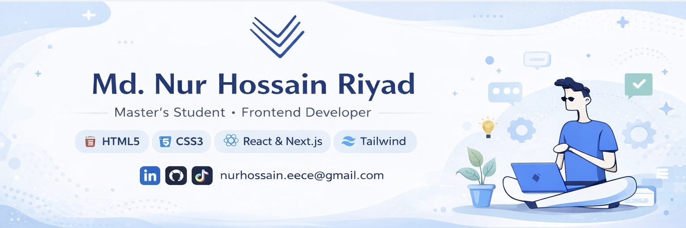

  

  

<h3 align="center">
  M.Sc. Communication Systems and Networks Student | Frontend & Full-Stack Web Developer
</h3>

  📍 Köln, Germany &nbsp; | &nbsp; 📧 nurhossain.eece@gmail.com

  
  
  

---

## 💫 About Me

I am a Master’s student in **Communication Systems and Networks** at **TH Köln** and a motivated **Frontend / Full-Stack Web Developer** based in Köln, Germany.

I build responsive and practical web applications using **React, Next.js, Tailwind CSS, Node.js, Express.js, MongoDB, REST APIs, authentication, and Vercel deployment**.

I have developed real-world projects such as **StudyNook**, **SkillSphere**, and **KeenKeeper**, where I practiced authentication, protected routes, CRUD operations, booking systems, search/filter logic, dashboard UI, and responsive design.

I am eager to contribute to real-world products by building clean interfaces, useful features, and reliable web applications while continuing to grow as a developer.

---

## 🛠️ Technical Skills

### Core Technologies

  

### Frontend
- HTML5, CSS3, JavaScript ES6+
- React.js, Next.js App Router
- Tailwind CSS, DaisyUI, HeroUI
- Responsive Web Design
- Component-Based UI
- Forms, loading states, custom 404 pages

### Backend & Database
- Node.js, Express.js
- MongoDB, MongoDB Atlas
- REST API development
- CRUD operations
- Search and filter logic
- Query parameters
- Booking conflict checking

### Authentication & Tools
- Better Auth
- JWT authentication
- Email/password login
- Google login
- Protected routes
- Git, GitHub, npm
- Vercel deployment
- Environment variables

---

## 🚀 Featured Projects

### 📚 StudyNook – Library Study Room Booking Platform

A full-stack study room booking platform where users can browse rooms, search/filter rooms, register/login, add rooms, book rooms, manage listings, and cancel bookings.

**Key Features**
- Room listing and room details
- Authentication and protected routes
- Add, update, and delete rooms
- Owner-only update/delete logic
- Booking system with date and time
- Booking conflict prevention
- Search and filter functionality
- MongoDB database and REST APIs
- Responsive UI and Vercel deployment

**Tech Stack:** Next.js, React, Tailwind CSS, HeroUI, Node.js, Express.js, MongoDB, Better Auth, JWT, Vercel

🔗 **Live Site:** https://study-nook-client-chi.vercel.app  
💻 **Client Code:** https://github.com/nurhossain-webd/studynook-client.git  
🖥️ **Server Code:** https://github.com/nurhossain-webd/study-nook-server.git  

---

### 🎓 SkillSphere – Online Learning Platform

A full-stack online learning platform where users can browse courses, search by title, view protected course details, register/login, and update profile information.

**Key Features**
- Course listing using data
- Search courses by title
- Popular and trending courses sections
- Protected course details page
- Email/password authentication
- Google login
- User profile update
- Loading spinner and toast notifications
- Responsive UI and Vercel deployment

**Tech Stack:** Next.js, React, Tailwind CSS, DaisyUI, BetterAuth, MongoDB, Motion, React Toastify, Vercel

🔗 **Live Site:** https://skillphere-project.vercel.app  
💻 **GitHub:** https://github.com/nurhossain-webd/Skillphere-Project.git  

---

### 🌿 KeenKeeper – Friendship Tracker Web App

A responsive friendship tracker dashboard that helps users manage relationships, log interactions, view timelines, and analyze friendship activity.

**Key Features**
- Friend dashboard
- Dynamic friend details page
- Quick Check-In system for Call, Text, and Video
- Timeline logging with date and time
- Search, filter, and sort functionality
- Pie chart analytics using Recharts
- Context API state management
- Responsive design and custom 404 page

**Tech Stack:** Next.js, React, Tailwind CSS, Context API, Recharts, React Toastify, React Icons

🔗 **Live Site:** https://keep-keen-project-7-alpha.vercel.app/  
💻 **GitHub:** https://github.com/nurhossain-webd/Keep-Keen-project-7.git  

---

## 📚 Education & Certification

### 🎓 M.Sc. in Communication Systems and Networks
**TH Köln, Köln, Germany**  
2023 – Present

Relevant Coursework: Computer Networks, Web Development

### 🎓 B.Sc. in Electrical, Electronic and Communication Engineering
**Pabna University of Science and Technology, Pabna, Bangladesh**  
2016 – 2022

### 🏅 CCNA
**Cisco**  
2025

---

## 🌍 Languages

- Bangla – Native
- English – C1
- German – B1
- Hindi / Urdu – Conversational

---

## 📊 GitHub Stats

  
  

  

---

## 🌐 Connect with Me

  
  
  

---

  Thanks for visiting my profile! ⭐

``
